# High-Level Architecture Design — BioTest Diagnostics Servicing

**Solution ID:** `DWS.07` · **Platform:** `DWS` · **Blueprint:** `platform/v1.5.0` · **Deploy layer:** L03
**Generated:** 2026-08-10T08:39:24.516Z by generator `7673816b` from `docs/10-Solutions/DWS.07-SOLUTION.md`. Derived from the manifest — re-run `pnpm scaffold -- ... --force` to refresh `solution/_arch/SOLUTION.md`; this HLAD itself is create-if-missing and NOT auto-refreshed (edit it by hand as the solution evolves).

## 1. Module map (Layer 07)

| Module | Name | Route | Journey stage | Features |
|---|---|---|---|---|
| DWS.07.S01 | My Dashboard | `/dashboard` | 2 | APP.F21 |
| DWS.07.S02 | My Work | `/my-work` | 2 | APP.F01 |
| DWS.07.S03 | Enquiries | `/transactions/enquiries` | 2 | APP.F01 |
| DWS.07.S04 | Requests | `/transactions/requests` | 2 | APP.F01 |
| DWS.07.S05 | Support Tickets | `/transactions/support-tickets` | 2 | APP.F01 |
| DWS.07.S06 | Wallet | `/transactions/wallet` | 2 | APP.F01 |
| DWS.07.S07 | Calendar | `/collaboration/calendar` | 2 | APP.F01 |
| DWS.07.S08 | Forums | `/collaboration/forums` | 2 | APP.F19 |
| DWS.07.S09 | Cases | `/manage-work/cases` | 2 | APP.F19 |
| DWS.07.S10 | Assignments | `/manage-work/assignments` | 2 | APP.F19 |
| DWS.07.S11 | Reviews | `/manage-work/reviews` | 2 | APP.F19 |
| DWS.07.S12 | Escalations | `/manage-work/escalations` | 2 | APP.F19 |
| DWS.07.S13 | Work Queue | `/monitor-work/queue` | 2 | APP.F19 |
| DWS.07.S14 | Alerts | `/monitor-work/alerts` | 2 | APP.F01 |
| DWS.07.S15 | Service Catalogue | `/manage-services/catalogue` | 2 | APP.F19 |
| DWS.07.S16 | Service Requests | `/manage-services/requests` | 2 | APP.F19 |
| DWS.07.S17 | Service Lifecycle | `/manage-services/lifecycle` | 2 | APP.F19 |
| DWS.07.S18 | Service Quality | `/manage-services/quality` | 2 | APP.F01 |
| DWS.07.S19 | Customers / Participants | `/manage-relationships/customers` | 2 | APP.F19 |
| DWS.07.S20 | Partners | `/manage-relationships/partners` | 2 | APP.F19 |
| DWS.07.S21 | Providers | `/manage-relationships/providers` | 2 | APP.F19 |
| DWS.07.S22 | Account Management | `/manage-relationships/accounts` | 2 | APP.F19 |
| DWS.07.S23 | Delivery Plans | `/manage-delivery/plans` | 2 | APP.F19 |
| DWS.07.S24 | Tasks | `/manage-delivery/tasks` | 2 | APP.F19 |
| DWS.07.S25 | Cases | `/manage-delivery/cases` | 2 | APP.F19 |
| DWS.07.S26 | Incidents | `/manage-delivery/incidents` | 2 | APP.F19 |
| DWS.07.S27 | Escalations | `/manage-delivery/escalations` | 2 | APP.F19 |
| DWS.07.S28 | Fulfilment Tracking | `/manage-delivery/fulfilment` | 2 | APP.F01 |
| DWS.07.S29 | Operational Dashboards | `/dashboards/operational` | 2 | ANL.F03, ANL.F02, ANL.F02, ANL.F02 |
| DWS.07.S30 | Executive Dashboards | `/dashboards/executive` | 2 | ANL.F03, ANL.F02, ANL.F02, ANL.F02 |
| DWS.07.S31 | Custom Dashboards | `/dashboards/custom` | 2 | ANL.F03, ANL.F02 |
| DWS.07.S32 | Alerts & Notifications | `/dashboards/alerts` | 2 | APP.F01 |
| DWS.07.S33 | KPI Scorecards | `/dashboards/scorecards` | 2 | ANL.F03, ANL.F02 |
| DWS.07.S34 | Ad-hoc Analysis | `/analytics/adhoc` | 2 | ANL.F03, ANL.F02 |
| DWS.07.S35 | Trend Analysis | `/analytics/trends` | 2 | ANL.F03, ANL.F02 |
| DWS.07.S36 | Root Cause Analysis | `/analytics/root-cause` | 2 | ANL.F03, ANL.F02 |
| DWS.07.S37 | Cohort Analysis | `/analytics/cohort` | 2 | ANL.F03, ANL.F02 |
| DWS.07.S38 | Benchmarking | `/analytics/benchmarking` | 2 | ANL.F03, ANL.F02 |
| DWS.07.S39 | Standard Reports | `/reports/standard` | 2 | ANL.F03, ANL.F02 |
| DWS.07.S40 | Custom Reports | `/reports/custom` | 2 | ANL.F03, ANL.F02 |
| DWS.07.S41 | Scheduled Reports | `/reports/scheduled` | 2 | ANL.F03, ANL.F02 |
| DWS.07.S42 | Report Subscriptions | `/reports/subscriptions` | 2 | APP.F01 |
| DWS.07.S43 | Export & Sharing | `/reports/export` | 2 | APP.F01 |
| DWS.07.S44 | Organisation Setup | `/admin/organisation` | 2 | APP.F01 |
| DWS.07.S45 | Workspace Settings | `/admin/workspace-settings` | 2 | APP.F01 |
| DWS.07.S46 | Branding | `/admin/branding` | 2 | APP.F01 |
| DWS.07.S47 | Regional & Language | `/admin/regional` | 2 | APP.F01 |
| DWS.07.S48 | Business Hours | `/admin/business-hours` | 2 | APP.F01 |
| DWS.07.S49 | Default Values | `/admin/defaults` | 2 | APP.F01 |
| DWS.07.S50 | User Management | `/admin/users` | 2 | APP.F19 |
| DWS.07.S51 | Role Management | `/admin/roles` | 2 | APP.F19 |
| DWS.07.S52 | Access Control | `/admin/access-control` | 2 | APP.F01 |
| DWS.07.S53 | Authentication Settings | `/admin/auth` | 2 | APP.F01 |
| DWS.07.S54 | Form Builder | `/admin/form-builder` | 2 | APP.F01 |
| DWS.07.S55 | Workflow Builder | `/admin/workflow-builder` | 2 | APP.F01 |
| DWS.07.S56 | Rule Management | `/admin/rules` | 2 | APP.F01 |
| DWS.07.S57 | Data Model | `/admin/data-model` | 2 | APP.F01 |
| DWS.07.S58 | Master Data | `/admin/master-data` | 2 | APP.F19 |
| DWS.07.S59 | Reference Data | `/admin/reference-data` | 2 | APP.F19 |
| DWS.07.S60 | Data Quality Rules | `/admin/data-quality` | 2 | APP.F01 |
| DWS.07.S61 | Data Lineage | `/admin/data-lineage` | 2 | ANL.F03, ANL.F02 |
| DWS.07.S62 | API Management | `/admin/apis` | 2 | APP.F01 |
| DWS.07.S63 | Connectors | `/admin/connectors` | 2 | APP.F01 |
| DWS.07.S64 | Data Flows | `/admin/data-flows` | 2 | APP.F01 |
| DWS.07.S65 | Data Import | `/admin/data-import` | 2 | APP.F01 |
| DWS.07.S66 | Policy Management | `/admin/policies` | 2 | APP.F19 |
| DWS.07.S67 | Control Register | `/admin/controls` | 2 | APP.F19 |
| DWS.07.S68 | Risk Register | `/admin/risks` | 2 | APP.F19 |
| DWS.07.S69 | Security Logs | `/admin/security-logs` | 2 | ANL.F03, ANL.F02 |
| DWS.07.M01 | Servicing Queue | `/servicing` | 3 | APP.F19, ANL.F03 |
| DWS.07.M02 | Imaging & Radiology | `/marketplace/discern` | 1 | APP.F10 |
| DWS.07.M03 | Diagnostic Procedures | `/marketplace/design` | 1 | APP.F10 |
| DWS.07.M04 | Sample Collection | `/marketplace/deploy` | 1 | APP.F10 |
| DWS.07.M05 | Back Office | `/marketplace/drive` | 1 | APP.F10 |

## 2. Platform services wired (Layer 06)

| Service | Provides | Mounted at |
|---|---|---|
| PS.AUTH | Authenticate users, issue and verify sessions, federate identity. | `/api/platform/auth` |
| PS.RBAC | Authorize actions against roles and resource scopes. | `/api/platform/rbac` |
| PS.DATA | Entity persistence, query, and schema registry — the canonical data plane. | `/api/platform/data` |
| PS.AUDIT | Records who did what to which entity, immutably; serves activity feeds. | `/api/platform/audit` |
| PS.NOTIF | Deliver and manage notifications across channels (in-app, email, sms). | `/api/platform/notif` |
| PS.SEARCH | Index and query entities across the solution. | `/api/platform/search` |

Layer 06 platform services are built once by the factory and are never reimplemented in solution code — see `AGENTS.md` "File ownership contract".

## 3. Module ↔ service diagram

```mermaid
graph LR
  subgraph Modules
    DWS_07_S01["DWS.07.S01<br/>/dashboard"]
    DWS_07_S02["DWS.07.S02<br/>/my-work"]
    DWS_07_S03["DWS.07.S03<br/>/transactions/enquiries"]
    DWS_07_S04["DWS.07.S04<br/>/transactions/requests"]
    DWS_07_S05["DWS.07.S05<br/>/transactions/support-tickets"]
    DWS_07_S06["DWS.07.S06<br/>/transactions/wallet"]
    DWS_07_S07["DWS.07.S07<br/>/collaboration/calendar"]
    DWS_07_S08["DWS.07.S08<br/>/collaboration/forums"]
    DWS_07_S09["DWS.07.S09<br/>/manage-work/cases"]
    DWS_07_S10["DWS.07.S10<br/>/manage-work/assignments"]
    DWS_07_S11["DWS.07.S11<br/>/manage-work/reviews"]
    DWS_07_S12["DWS.07.S12<br/>/manage-work/escalations"]
    DWS_07_S13["DWS.07.S13<br/>/monitor-work/queue"]
    DWS_07_S14["DWS.07.S14<br/>/monitor-work/alerts"]
    DWS_07_S15["DWS.07.S15<br/>/manage-services/catalogue"]
    DWS_07_S16["DWS.07.S16<br/>/manage-services/requests"]
    DWS_07_S17["DWS.07.S17<br/>/manage-services/lifecycle"]
    DWS_07_S18["DWS.07.S18<br/>/manage-services/quality"]
    DWS_07_S19["DWS.07.S19<br/>/manage-relationships/customers"]
    DWS_07_S20["DWS.07.S20<br/>/manage-relationships/partners"]
    DWS_07_S21["DWS.07.S21<br/>/manage-relationships/providers"]
    DWS_07_S22["DWS.07.S22<br/>/manage-relationships/accounts"]
    DWS_07_S23["DWS.07.S23<br/>/manage-delivery/plans"]
    DWS_07_S24["DWS.07.S24<br/>/manage-delivery/tasks"]
    DWS_07_S25["DWS.07.S25<br/>/manage-delivery/cases"]
    DWS_07_S26["DWS.07.S26<br/>/manage-delivery/incidents"]
    DWS_07_S27["DWS.07.S27<br/>/manage-delivery/escalations"]
    DWS_07_S28["DWS.07.S28<br/>/manage-delivery/fulfilment"]
    DWS_07_S29["DWS.07.S29<br/>/dashboards/operational"]
    DWS_07_S30["DWS.07.S30<br/>/dashboards/executive"]
    DWS_07_S31["DWS.07.S31<br/>/dashboards/custom"]
    DWS_07_S32["DWS.07.S32<br/>/dashboards/alerts"]
    DWS_07_S33["DWS.07.S33<br/>/dashboards/scorecards"]
    DWS_07_S34["DWS.07.S34<br/>/analytics/adhoc"]
    DWS_07_S35["DWS.07.S35<br/>/analytics/trends"]
    DWS_07_S36["DWS.07.S36<br/>/analytics/root-cause"]
    DWS_07_S37["DWS.07.S37<br/>/analytics/cohort"]
    DWS_07_S38["DWS.07.S38<br/>/analytics/benchmarking"]
    DWS_07_S39["DWS.07.S39<br/>/reports/standard"]
    DWS_07_S40["DWS.07.S40<br/>/reports/custom"]
    DWS_07_S41["DWS.07.S41<br/>/reports/scheduled"]
    DWS_07_S42["DWS.07.S42<br/>/reports/subscriptions"]
    DWS_07_S43["DWS.07.S43<br/>/reports/export"]
    DWS_07_S44["DWS.07.S44<br/>/admin/organisation"]
    DWS_07_S45["DWS.07.S45<br/>/admin/workspace-settings"]
    DWS_07_S46["DWS.07.S46<br/>/admin/branding"]
    DWS_07_S47["DWS.07.S47<br/>/admin/regional"]
    DWS_07_S48["DWS.07.S48<br/>/admin/business-hours"]
    DWS_07_S49["DWS.07.S49<br/>/admin/defaults"]
    DWS_07_S50["DWS.07.S50<br/>/admin/users"]
    DWS_07_S51["DWS.07.S51<br/>/admin/roles"]
    DWS_07_S52["DWS.07.S52<br/>/admin/access-control"]
    DWS_07_S53["DWS.07.S53<br/>/admin/auth"]
    DWS_07_S54["DWS.07.S54<br/>/admin/form-builder"]
    DWS_07_S55["DWS.07.S55<br/>/admin/workflow-builder"]
    DWS_07_S56["DWS.07.S56<br/>/admin/rules"]
    DWS_07_S57["DWS.07.S57<br/>/admin/data-model"]
    DWS_07_S58["DWS.07.S58<br/>/admin/master-data"]
    DWS_07_S59["DWS.07.S59<br/>/admin/reference-data"]
    DWS_07_S60["DWS.07.S60<br/>/admin/data-quality"]
    DWS_07_S61["DWS.07.S61<br/>/admin/data-lineage"]
    DWS_07_S62["DWS.07.S62<br/>/admin/apis"]
    DWS_07_S63["DWS.07.S63<br/>/admin/connectors"]
    DWS_07_S64["DWS.07.S64<br/>/admin/data-flows"]
    DWS_07_S65["DWS.07.S65<br/>/admin/data-import"]
    DWS_07_S66["DWS.07.S66<br/>/admin/policies"]
    DWS_07_S67["DWS.07.S67<br/>/admin/controls"]
    DWS_07_S68["DWS.07.S68<br/>/admin/risks"]
    DWS_07_S69["DWS.07.S69<br/>/admin/security-logs"]
    DWS_07_M01["DWS.07.M01<br/>/servicing"]
    DWS_07_M02["DWS.07.M02<br/>/marketplace/discern"]
    DWS_07_M03["DWS.07.M03<br/>/marketplace/design"]
    DWS_07_M04["DWS.07.M04<br/>/marketplace/deploy"]
    DWS_07_M05["DWS.07.M05<br/>/marketplace/drive"]
  end
  subgraph "Layer 06 — Platform Services"
    PS_AUTH["PS.AUTH"]
    PS_RBAC["PS.RBAC"]
    PS_DATA["PS.DATA"]
    PS_AUDIT["PS.AUDIT"]
    PS_NOTIF["PS.NOTIF"]
    PS_SEARCH["PS.SEARCH"]
  end
  DWS_07_S01 --> PS_DATA
  DWS_07_S02 --> PS_DATA
  DWS_07_S03 --> PS_DATA
  DWS_07_S04 --> PS_DATA
  DWS_07_S05 --> PS_DATA
  DWS_07_S06 --> PS_DATA
  DWS_07_S07 --> PS_DATA
  DWS_07_S08 --> PS_DATA
  DWS_07_S09 --> PS_DATA
  DWS_07_S10 --> PS_DATA
  DWS_07_S11 --> PS_DATA
  DWS_07_S12 --> PS_DATA
  DWS_07_S13 --> PS_DATA
  DWS_07_S14 --> PS_DATA
  DWS_07_S15 --> PS_DATA
  DWS_07_S16 --> PS_DATA
  DWS_07_S17 --> PS_DATA
  DWS_07_S18 --> PS_DATA
  DWS_07_S19 --> PS_DATA
  DWS_07_S20 --> PS_DATA
  DWS_07_S21 --> PS_DATA
  DWS_07_S22 --> PS_DATA
  DWS_07_S23 --> PS_DATA
  DWS_07_S24 --> PS_DATA
  DWS_07_S25 --> PS_DATA
  DWS_07_S26 --> PS_DATA
  DWS_07_S27 --> PS_DATA
  DWS_07_S28 --> PS_DATA
  DWS_07_S29 --> PS_DATA
  DWS_07_S30 --> PS_DATA
  DWS_07_S31 --> PS_DATA
  DWS_07_S32 --> PS_DATA
  DWS_07_S33 --> PS_DATA
  DWS_07_S34 --> PS_DATA
  DWS_07_S35 --> PS_DATA
  DWS_07_S36 --> PS_DATA
  DWS_07_S37 --> PS_DATA
  DWS_07_S38 --> PS_DATA
  DWS_07_S39 --> PS_DATA
  DWS_07_S40 --> PS_DATA
  DWS_07_S41 --> PS_DATA
  DWS_07_S42 --> PS_DATA
  DWS_07_S43 --> PS_DATA
  DWS_07_S44 --> PS_DATA
  DWS_07_S45 --> PS_DATA
  DWS_07_S46 --> PS_DATA
  DWS_07_S47 --> PS_DATA
  DWS_07_S48 --> PS_DATA
  DWS_07_S49 --> PS_DATA
  DWS_07_S50 --> PS_DATA
  DWS_07_S51 --> PS_DATA
  DWS_07_S52 --> PS_DATA
  DWS_07_S53 --> PS_DATA
  DWS_07_S54 --> PS_DATA
  DWS_07_S55 --> PS_DATA
  DWS_07_S56 --> PS_DATA
  DWS_07_S57 --> PS_DATA
  DWS_07_S58 --> PS_DATA
  DWS_07_S59 --> PS_DATA
  DWS_07_S60 --> PS_DATA
  DWS_07_S61 --> PS_DATA
  DWS_07_S62 --> PS_DATA
  DWS_07_S63 --> PS_DATA
  DWS_07_S64 --> PS_DATA
  DWS_07_S65 --> PS_DATA
  DWS_07_S66 --> PS_DATA
  DWS_07_S67 --> PS_DATA
  DWS_07_S68 --> PS_DATA
  DWS_07_S69 --> PS_DATA
  DWS_07_M01 --> PS_DATA
  DWS_07_M01 --> PS_AUDIT
  DWS_07_M02 --> PS_DATA
  DWS_07_M02 --> PS_SEARCH
  DWS_07_M03 --> PS_DATA
  DWS_07_M03 --> PS_SEARCH
  DWS_07_M04 --> PS_DATA
  DWS_07_M04 --> PS_SEARCH
  DWS_07_M05 --> PS_DATA
  DWS_07_M05 --> PS_SEARCH
```

## 4. Entities

- **lab-service** — fields: name, summary, department, status, code, slaTargetHours
- **exam-order** — fields: patientName, patientPhone, source, department, serviceCode, siteId, status, technicianId, releasedAt, notes, referrerAccountId
- **demo-record** — fields: name, status, owner, priority, category, updated
- **demo-catalog-item** — fields: name, summary, category, status, code
- **service-offering-request** — fields: serviceId, description, urgency, justification
- **reminder** — fields: title, dueAt, done, userId

## 5. Workflows

No feature wires PS.WORKFLOW in this manifest.

## 6. Shells

`@dbp/shell-transaction` (SH.02), `@dbp/shell-transaction` (SH.03), `@dbp/shell-transaction` (SH.01)

## 7. Demo identities & tenancy

- Seeded accounts (PS.AUTH consumed: yes): `platform-admin@alpha.dev.local` and `user-01@alpha.dev.local`, password `dbp-dev-password` — see `solution/fixtures/demo-identities.ts`.
- Primary tenant: `tenant-alpha`. The platform-admin identity also carries a `tenant-beta-demo` membership, demonstrating the workspace tenant switcher.
- Storage mode: prototype (in-memory, non-persistent).

## 8. Deploy layer

`L03` — see `docs/06-Operations/deployment.md` for the deployment runbook.
