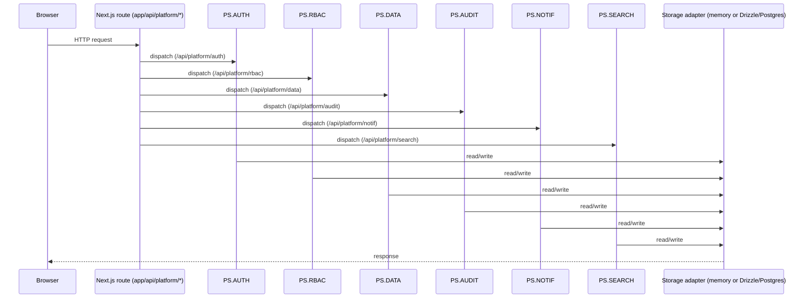

# Low-Level Design — Platform Services (Layer 06, cross-cutting) — BioTest Diagnostics Servicing

**Solution ID:** `DWS.07` · **Blueprint:** `platform/v1.5.0`
**Generated:** 2026-08-10T08:39:24.516Z by generator `7673816b`. Covers only the PS.* services this manifest declares under `consumes_platform_services`; undeclared services are omitted, not stubbed. Create-if-missing — hand-edit as the solution evolves.

## 1. Services wired

### PS.AUTH

- **Provides:** Authenticate users, issue and verify sessions, federate identity.
- **Package:** `@dbp/ps-auth`
- **Route surface:** `/api/platform/auth/*` (handled by `app/api/platform/auth/[[...path]]/route.ts`)
- **Env contract:** DBP_AUTH_SESSION_SECRET (required, 32+ hex chars); DBP_IDP_PROVIDER (password|ldap|entra|entra-external, default password)
- **Wiring seam:** per-route-chunk self-bootstrap (own chunk seeds DEMO_IDENTITIES; instrumentation.ts is not visible across chunk isolation)

### PS.RBAC

- **Provides:** Authorize actions against roles and resource scopes.
- **Package:** `@dbp/ps-rbac`
- **Route surface:** `/api/platform/rbac/*` (handled by `app/api/platform/rbac/[[...path]]/route.ts`)
- **Env contract:** none — session-derived (x-dbp-session header set by PS.AUTH's verify step)
- **Wiring seam:** instrumentation.ts (registered once at server boot via instrumentation.node.ts)

### PS.DATA

- **Provides:** Entity persistence, query, and schema registry — the canonical data plane.
- **Package:** `@dbp/ps-data`
- **Route surface:** `/api/platform/data/entities/<type>` (list/create), `/api/platform/data/entities/<type>/<id>` (get/update/delete)
- **Env contract:** none — in-memory adapter (prototype storage mode)
- **Wiring seam:** per-route-chunk self-bootstrap (registerAndSeedData() re-run per chunk)

### PS.AUDIT

- **Provides:** Records who did what to which entity, immutably; serves activity feeds.
- **Package:** `@dbp/ps-audit`
- **Route surface:** `/api/platform/audit/*` (handled by `app/api/platform/audit/[[...path]]/route.ts`)
- **Env contract:** AUDIT_STORAGE (memory|drizzle, default memory; drizzle requires DATABASE_URL)
- **Wiring seam:** instrumentation.ts (registered once at server boot via instrumentation.node.ts)

### PS.NOTIF

- **Provides:** Deliver and manage notifications across channels (in-app, email, sms).
- **Package:** `@dbp/ps-notif`
- **Route surface:** `/api/platform/notif/*` (handled by `app/api/platform/notif/[[...path]]/route.ts`)
- **Env contract:** NOTIF_EMAIL_TRANSPORT (smtp|msgraph|console); SMTP_URL / SMTP_FROM or MSGRAPH_* (per transport)
- **Wiring seam:** instrumentation.ts (registered once at server boot via instrumentation.node.ts)

### PS.SEARCH

- **Provides:** Index and query entities across the solution.
- **Package:** `@dbp/ps-search`
- **Route surface:** `/api/platform/search/*` (handled by `app/api/platform/search/[[...path]]/route.ts`)
- **Env contract:** none — in-memory index, seeded at bootstrap
- **Wiring seam:** instrumentation.ts (registered once at server boot via instrumentation.node.ts)

## 2. Session & tenancy model

- PS.AUTH issues a session JWT carrying `memberships` (tenant IDs the user belongs to) and an active `tenantId`. Tenant switch re-issues the session with a new active `tenantId` from the existing memberships — no re-authentication.
- On each request, the calling route verifies the session (`POST /api/platform/auth/verify`) and sets `x-dbp-session = base64(JSON.stringify(session))`, which PS.RBAC, PS.WORKFLOW, and PS.NOTIF read per their SERVICE.md contracts — RBAC checks and data scoping are session-derived, never re-derived per service.

## 3. Request path through the cross-cutting layer

## 4. Non-negotiable

Layer 06 platform services are built once by the factory. Solutions never reimplement auth, RBAC, audit, notifications, search, or workflow — they call the services above by ID and consume them.
