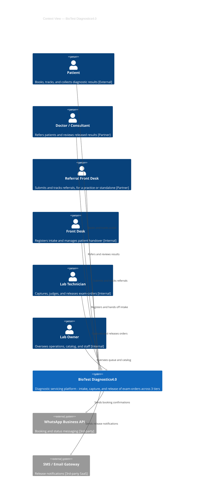
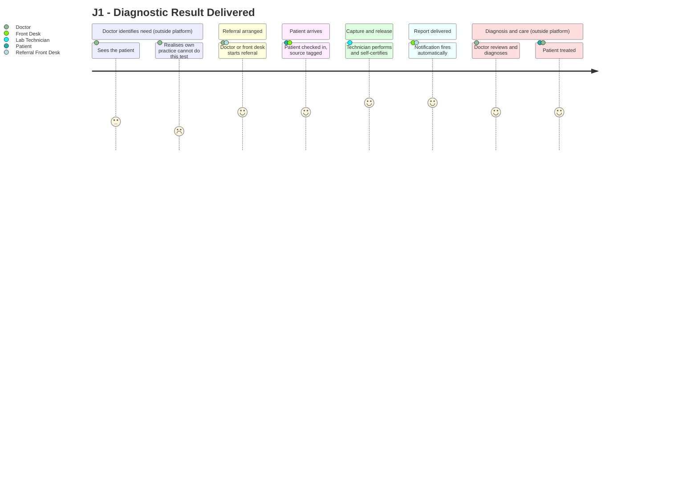
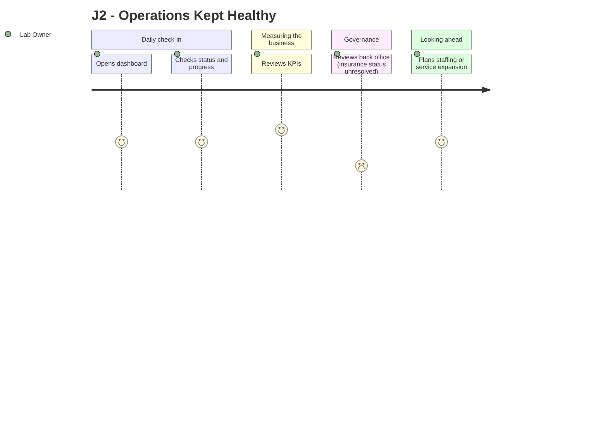
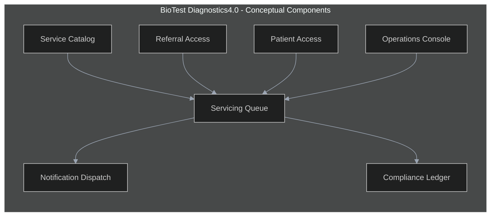
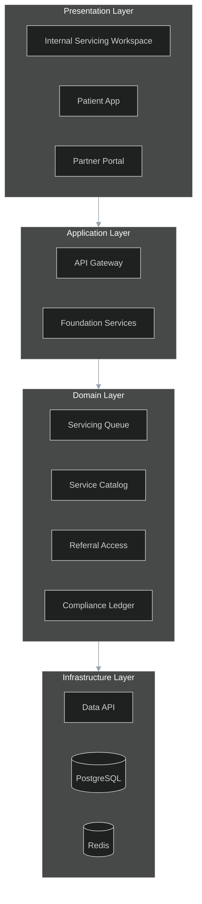

# BioTest Diagnostics4.0 — High Level Architecture Design

**Version:** 1.0 (draft)
**Date:** 2026-08-05
**Status:** Draft — Pending Approval
**DBP ID:** DWS.02.03

---

## 1. Introduction

This document is the High Level Architecture Design for BioTest Diagnostics4.0, a diagnostic servicing platform for BioTest, a Nairobi diagnostic imaging and lab business. It establishes the platform's business context, strategic vision, and the architecture principles that govern every design decision in the sections that follow.

### 1.1 Business Context

BioTest's business context is defined by a single-site diagnostic operation moving from disconnected manual intake to a unified servicing system, and by a clinical model where the platform itself never diagnoses.

| # | Title | Description |
|---|---|---|
| 01 | Strategic Objectives | Give BioTest one system of record for diagnostic servicing — intake through release — with role-appropriate access for internal staff, patients, and referring clinics, and no clinical decision-making inside the platform itself. |
| 02 | Market Dynamics | Private outpatient diagnostics is an active growth segment in urban Nairobi, positioned against public-hospital wait times. Comparable platforms researched (Abbadox, EMSOW, Medicai, MedicsRIS, Simplirad) universally assume an internal clinical-review stage and a practice-linked referrer account — neither assumption holds for BioTest. |
| 03 | Stakeholder Segments | Six named segments across three tiers: Patient and Doctor/Consultant plus Referral Front Desk (External/Partners), and Front Desk, Lab Technician, and Lab Owner (Internal) — each with distinct platform activities and permissions. |
| 04 | Current Challenges | Intake runs across four disconnected channels (walk-in, WhatsApp, phone, referral) with no shared record; the "same-day report" claim is currently unbacked by any turnaround tracking; referral relationships and audit trail are entirely undocumented today. |

### 1.2 Platform Vision

| # | Title | Description |
|---|---|---|
| 01 | Platform Objective | Provide a single diagnostic-servicing system of record covering intake, quality-controlled capture, and release, replacing ad hoc manual coordination across three intake channels. |
| 02 | Platform Strategy | Model BioTest as a capture-and-release utility, not a diagnosing provider — the referring doctor remains the sole clinical authority; the platform's role is turnaround, accuracy, and traceability. |
| 03 | Platform Technology | Three-tier application architecture: React/Next.js client tier, Express/BFF application tier, PostgreSQL via Supabase/PostgREST data tier, with Redis for cache and session state. |
| 04 | Platform Architecture | One SoA-level platform (DWS.02.03) serving three user tiers — Internal, External (Patient), Partners (Doctor/Referral Front Desk) — through tier-appropriate S00/S01 entry points onto a shared S02+ data model, rather than three separately numbered platforms. |
| 05 | Platform Implementation | Feature-backlog-driven delivery, P0 features forming the prototype-critical path (Servicing Queue, Catalog, Referral and Patient self-service), P1 features completing initial release scope. |
| 06 | Platform Deployment | Single-site deployment at launch (Upper Hill, Nairobi); a `site_id` field is carried on core entities as architectural insurance against a plausible second location within 12–24 months, with no build commitment beyond the field. |

### 1.3 Architecture Principles

The architecture principles governing this platform establish the design constraints that every delivery workstream must observe, derived directly from the Design Constraints recorded in the Business Requirements Specification §6.

| # | ID | Principle | Description |
|---|---|---|---|
| 01 | AP-01 | Single Data Model | `exam-order` and `lab-service` are shared entities read and written across all three tiers' front doors. No tier forks its own copy. |
| 02 | AP-02 | Three-Tier Architecture | Business logic, orchestration, and access control are confined to the Application & Integration Layer. The Client Tier renders UI only. |
| 03 | AP-03 | Universal Anchor | Every exam-order, regardless of source channel, anchors to `s2_account.requests`. Stage 4 (Compliance & Audit) reads from this anchor rather than rebuilding request state. |
| 04 | AP-04 | Downward-Only Dependency | Higher stages reference lower stages; lower stages never reference higher ones. |
| 05 | AP-05 | Immutable Audit Trail | Every capture, release, and recapture event is logged and cannot be deleted under any permission level, including the Lab Owner's. |
| 06 | AP-06 | No Reimplemented Foundation | IAM, audit, and notifications are Platform Foundation services, consumed by every tier, never rebuilt per surface. |
| 07 | AP-07 | Data Sovereignty | Patient health data is sensitive personal data under Kenya's Data Protection Act 2019; hosting and processing must support DPA compliance. |
| 08 | AP-08 | No Internal Clinical Review | Deliberate absence of a workflow/approval engine — the capturing technician judges accuracy and releases in a single action; release authority never sits with a second internal reviewer. |

---

## 2. Solution Architecture

This section presents the platform-level architecture context — the three technology layers and the strategic model they serve. The remaining sections of this document elaborate the specific architecture for BioTest Diagnostics4.0 within this shared model.

### 2.1 Platform Context

The platform context sub-section presents the overall architecture model and how its three layers work together to keep business logic, data access, and user experience cleanly separated.

BioTest Diagnostics4.0 centralises all diagnostic-servicing state in one data model, exposed through a single application layer to three distinct client surfaces. No tier — Internal, Patient, or Partner — has direct database access; every read and write passes through the Application & Integration Layer and is mediated at the Data & Intelligence Layer boundary.

| # | Layer | Role |
|---|---|---|
| 01 | Client Tier | The user-facing digital engagement layer — web (React/Next.js) applications for the three surfaces. Renders UI and calls APIs only; no business logic lives here. |
| 02 | Data & Intelligence Layer | The data backbone — PostgreSQL as the system of record accessed via Supabase/PostgREST, Redis for cache and session state. Row-level security and database roles are enforced at this boundary. |
| 03 | Application & Integration Layer | The operational foundation — Express/BFF APIs, domain services, and background jobs. Business logic, orchestration, validation, and access control live exclusively here. |

### 2.2 Client Tier

The Client Tier is the user-facing boundary of the platform across all three surfaces, rendering the Internal Servicing Workspace, Patient App, and Partner Portal without holding any business logic of its own.

| # | Feature | Description |
|---|---|---|
| 01 | Internal Servicing Workspace | Desktop/tablet-oriented Next.js application for Front Desk, Lab Technician, and Lab Owner — the queue, catalog admin, and dashboard surfaces. |
| 02 | Patient App | Mobile-first Next.js application for booking, tracking, and report retrieval; pre-login front door and marketplace, post-login account experience. |
| 03 | Partner Portal | Mobile-first Next.js application for Doctor/Consultant and Referral Front Desk; supports both practice-linked and standalone referrer accounts under one role. |

### 2.3 Data & Intelligence Layer

The Data & Intelligence Layer is the data backbone of the platform, holding the single system of record every surface reads from and writes to.

| # | Feature | Description |
|---|---|---|
| 01 | PostgreSQL system of record | Schema-partitioned per the platform stage model — `platform`, `s1_discovery`, `s2_account`, `s3_ops`, `s4_diagnostics` — with strictly one-way foreign key direction. |
| 02 | Data API (Supabase/PostgREST) | Mediates all database access; enforces row-level security independently of application-tier auth checks. |
| 03 | Redis | Cache and session state; application instances remain stateless and horizontally scalable. |

### 2.4 Application & Integration Layer

The Application & Integration Layer ensures business logic, orchestration, and secure external integration live in exactly one place — inside a single scaffolded backend solution — never duplicated across the three client surfaces. **Corrected per AD-08:** only the Internal Servicing Workspace ships in the same deployment as the API Gateway; the Patient App and Partner Portal are independently deployed and hold no business logic or platform-service access of their own — they call the gateway through a thin server-side proxy client.

| # | Feature | Description |
|---|---|---|
| 01 | API Gateway (Express/BFF) | The one real backend, co-deployed with the Internal Servicing Workspace; enforces access control and orchestrates every exam-order transition for all three surfaces. |
| 02 | Foundation Services | Background service handling notification dispatch and audit logging, itself routed through the Data API rather than accessing PostgreSQL directly. |
| 03 | Notification integrations | WhatsApp Business API and an SMS/Email gateway, invoked asynchronously from Foundation Services on order release. |
| 04 | DWS-client proxy pattern | Thin server-side HTTP client inside Patient App and Partner Portal — the only path either surface has into platform state, modeled directly on the proven `apps/dxp` → `apps/dws` pattern. |

---

## 3. Architecture Spec — Context

This section establishes the platform's capability architecture at the context level, presenting both the full capability canvas and BioTest's platform-specific variant. These capabilities provide the basis for the architecture views in §5.

### 3.1 Capability Canvas

The capability canvas represents the full set of platform capabilities organised by delivery domain, as established in the BRS §3 domain structure.

| # | Capability Area | Description | Responsible Component |
|---|---|---|---|
| 01 | Servicing & Fulfilment | Intake, capture, self-certified release, and SLA tracking of exam-orders | API Gateway, Internal Servicing Workspace |
| 02 | Service Catalog | Department structure, service listings, pricing, SLA targets, publish scope per tier | API Gateway, Data & Intelligence Layer |
| 03 | Referral & Partner Access | Self-service and standalone referral accounts, marketplace browse, request submission | Partner Portal, API Gateway |
| 04 | Patient Access | Self-booking, walk-in linking, status tracking, report retrieval | Patient App, API Gateway |
| 05 | Operations & Workforce | Staff accounts, queue oversight, catalog admin, back office, KPI dashboard | Internal Servicing Workspace |
| 06 | Compliance & Audit | Immutable audit log, regulatory evidence export | Foundation Services, Data & Intelligence Layer |

### 3.2 Capability Canvas — BioTest Diagnostics4.0 Variant

This variant focuses on BioTest's programme priority delivery areas — the P0 capabilities that must be prototyped first because the prototype and build sequence are invalid without them — within the broader capability canvas above.

| # | Capability Area | Description | Responsible Component |
|---|---|---|---|
| 01 | Servicing & Fulfilment | P0 — the system-of-record capability; every other capability depends on the exam-order lifecycle existing first | API Gateway |
| 02 | Service Catalog | P0 — all three tiers' marketplaces read from this capability before any transaction can occur | Data & Intelligence Layer |
| 03 | Referral & Partner Access | P0 — the standalone-account model is the platform's core market differentiator | Partner Portal |
| 04 | Patient Access | P0 — self-booking is a named platform outcome (BRS §2.2) | Patient App |

---

## 4. Architecture Spec — Software

This section defines the technology stack, module decomposition, and deployment topology that implement the capabilities in §3. It is an implementation-level specification, not a detail design — component internals are deferred to system detail design documents (LLADs) not yet authored.

### 4.1 Technology Stack

The technology stack defines the technology choices by layer for the full platform, using the canonical DQ platform technology labels throughout.

| # | Layer | Technology | Purpose | Notes |
|---|---|---|---|---|
| 01 | Client | React / Next.js | Renders all three client surfaces | No mobile-native app; mobile-first responsive web |
| 02 | Application | Express / BFF | Business logic, orchestration, access control | Single gateway for all 3 surfaces |
| 03 | Application (background) | Node.js background service | Notification dispatch, audit logging | Routes through Data API, not direct to PostgreSQL |
| 04 | Data | PostgreSQL | System of record | Schema-partitioned per stage model |
| 05 | Data access | Supabase / PostgREST | Mediates all DB access, enforces RLS | No raw SQL from application code |
| 06 | Cache/session | Redis | Session state, cache | Stateless application instances |
| 07 | Notification channel | WhatsApp Business API | Booking and status messaging | 3rd-party |
| 08 | Notification channel | SMS/Email gateway | Release notifications | 3rd-party SaaS |
| 09 | Identity | Phone/email OTP or magic-link | Authentication across all 3 tiers | No SSO required at this scale |

### 4.2 Modules & Functions

The modules and functions view identifies the logical decomposition of the platform's software, corresponding directly to the containers in the Implementation Architecture (§5.7).

| # | Module | Function | Description | Responsible Actor |
|---|---|---|---|---|
| 01 | Internal Servicing Workspace | Client | Queue, catalog admin, dashboard UI | Front Desk, Lab Technician, Lab Owner |
| 02 | Patient App | Client | Booking and status tracking UI | Patient |
| 03 | Partner Portal | Client | Referral submission and tracking UI | Doctor/Consultant, Referral Front Desk |
| 04 | API Gateway | Application | Business logic, orchestration, access control | System (all tiers) |
| 05 | Foundation Services | Application | Notification dispatch, audit logging | System (background) |
| 06 | Data API | Data | Mediates DB access, enforces RLS | System |

### 4.3 Deployment Stack

**`[!]` Open decision.** No deployment environments, hosting provider, or infrastructure topology have been decided for BioTest Diagnostics4.0 — this was never in scope for the BRS and is not fabricated here. The table below records the environment *roles* the platform will need; the deployment target column is intentionally left as a decision pending rather than invented.

| # | Environment | Component | Deployment Target | Notes |
|---|---|---|---|---|
| 01 | Development | All modules | Decision required | AD-07 (§6.1) |
| 02 | Staging | All modules | Decision required | AD-07 (§6.1) |
| 03 | Production | All modules | Decision required | AD-07 (§6.1) |

---

## 5. Architecture Views

This section presents 13 architecture views specifying the platform's architecture, grouped as Business Spec (5.1–5.4), Technology Spec (5.5–5.10), and DevOps Spec (5.11–5.13). Ten of the thirteen views include a diagram; three (Deployment Environment, Source Code & Branching, CI/CD Pipelines) are prose/table-only since no infrastructure decisions exist yet to diagram.

### 5.1 System Context

This view establishes the platform boundary, its human actors, and the external systems it depends on — the single most important orientation diagram for the whole document.

The following architecture principles govern this view:
AP-01 — Single Data Model. AP-06 — No Reimplemented Foundation.

*Figure 5.1 — reproduced from `system-context.md`:*



| Arrow label | Protocol | Mode | Notes |
|---|---|---|---|
| Books and tracks a visit | HTTPS/REST | sync | Phone/email OTP or magic-link auth |
| Sends booking confirmations | WhatsApp Business API / HTTPS | async | Fire-and-forget, best-effort |

| # | Title | Description |
|---|---|---|
| 01 | Purpose | Give BioTest one system of record for diagnostic servicing, with no clinical decision-making inside the platform |
| 02 | Scope | Intake, capture, release, and SLA/audit tracking across walk-in, self-booked, and referred channels |
| 03 | Key Outputs | Released exam-order reports, referral status visibility, operational KPIs |

### 5.2 System Actors

This view identifies all actor groups interacting with the platform, both human and system, and their relationship tier.

<!-- TODO: Invoke diagram skill for this view. See composition-contract.md when available. -->
<!-- [system-actors_DIAGRAM] -->

| # | Title | Description |
|---|---|---|
| 01 | Patient | External tier — self-referred or consultant-sent; books, tracks, and collects results |
| 02 | Doctor / Consultant | Partners tier — independent or hospital-based, not contracted to BioTest; the platform's only clinical authority |
| 03 | Referral Front Desk | Partners tier — a doctor's staff, or a standalone referral coordinator with no linked practice |
| 04 | Front Desk (BioTest) | Internal tier — on-site intake/reception, no release rights |
| 05 | Lab Technician | Internal tier — captures, judges accuracy, and releases in one action |
| 06 | Lab Owner | Internal tier — full administrative rights across operations, catalog, and external-account approval |
| 07 | WhatsApp Business API | External system actor — booking and status channel |
| 08 | SMS/Email Gateway | External system actor — release notification channel |

### 5.3 System Interfaces

This view identifies all interface types the platform exposes or consumes across its three client surfaces and two external integrations.

<!-- TODO: Invoke diagram skill for this view. See composition-contract.md when available. -->
<!-- [system-interfaces_DIAGRAM] -->

| # | Title | Description |
|---|---|---|
| 01 | Internal Workspace API | REST interface consumed by the Internal Servicing Workspace — queue, catalog admin, dashboard operations |
| 02 | Patient App API | REST interface consumed by the Patient App — booking, tracking, report retrieval |
| 03 | Partner Portal API | REST interface consumed by the Partner Portal — referral submission and tracking |
| 04 | Data API | Internal PostgREST interface between the Application layer and PostgreSQL, RLS-enforced |
| 05 | WhatsApp Business API integration | Outbound async integration for booking confirmations |
| 06 | SMS/Email Gateway integration | Outbound async integration for release notifications |

### 5.4 System Journeys

This view presents the named goal-level journeys the platform supports, reproduced from `user-journeys.md`.

**J1 — Diagnostic Result Delivered.** Merges Doctor, Referral Front Desk, Patient, Front Desk, and Lab Technician into one handoff chain — the same underlying goal seen from five sides. Flow summary: doctor identifies need → referral arranged → patient intake → capture and release → report delivered → diagnosis and care (outside platform).



**J2 — Operations Kept Healthy.** Lab Owner's daily operational goal. Flow summary: opens dashboard → checks status/progress → reviews KPIs → manages catalog and staff → reviews back office → plans ahead.



### 5.5 Conceptual Architecture

This view identifies the platform's component groups at conceptual level, independent of implementation technology.

| # | Component Group | Purpose |
|---|---|---|
| 01 | Servicing Queue | Exam-order lifecycle: intake, capture, release |
| 02 | Service Catalog | Department structure, listings, SLA targets, publish scope |
| 03 | Referral Access | Partner-facing request submission and tracking |
| 04 | Patient Access | Self-service booking and tracking |
| 05 | Operations Console | Staff, catalog admin, back office, external-account approval |
| 06 | Compliance Ledger | Immutable audit trail, regulatory evidence export |
| 07 | Notification Dispatch | Multi-channel outbound messaging on state change |



| Arrow | Meaning |
|---|---|
| --> | Depends on / feeds |

### 5.6 Logical Architecture

This view organises the conceptual component groups into logical layers.

| # | Component Group | Purpose |
|---|---|---|
| 01 | Presentation | Internal Servicing Workspace, Patient App, Partner Portal |
| 02 | Application | API Gateway, Foundation Services |
| 03 | Domain | Servicing Queue, Service Catalog, Referral Access, Patient Access, Operations Console, Compliance Ledger |
| 04 | Infrastructure | PostgreSQL, Data API, Redis, Notification channels |



| Arrow | Meaning |
|---|---|
| --> | Depends on (compile-time dependency) |

### 5.7 Implementation Architecture

This view maps the platform's containers to the three canonical DQ platform tiers, reproduced from `containers.md`. **Corrected per AD-08** — see that document's header note for what changed and why.

The following architecture principles govern this view:
AP-02 — Three-Tier Architecture. AP-06 — No Reimplemented Foundation.

```plantuml
@startuml C4_Container_BioTest
!include https://raw.githubusercontent.com/plantuml-stdlib/C4-PlantUML/master/C4_Container.puml

skinparam backgroundColor #0d1117
skinparam defaultFontColor #e6edf3
skinparam ArrowColor #9aa4b2
skinparam shadowing false
skinparam roundCorner 8

LAYOUT_LEFT_RIGHT()
LAYOUT_WITH_LEGEND()

title Container View — BioTest Diagnostics4.0 (DWS-hub / DXP-thin-client)

Person(staff, "Internal Staff", "Front Desk, Lab Technician, Lab Owner")
Person(patient, "Patient")
Person(partner, "Doctor / Referral Front Desk")

System_Boundary(biotest, "BioTest Diagnostics4.0") {
    Container_Boundary(dwsHub, "DWS-equivalent solution - one scaffolded backend") {
        Container(internalApp, "Internal Servicing Workspace", "Next.js", "Queue, catalog admin, dashboard - same deployment as the gateway")
        Container(gateway, "API Gateway", "Express / BFF", "The one real backend - business logic, orchestration, access control")
        Container(foundation, "Foundation Services", "Node.js background service", "Notification dispatch and audit logging")
        Container(dataApi, "Data API", "Supabase / PostgREST", "Mediates DB access, enforces RLS")
        ContainerDb(postgres, "PostgreSQL", "PostgreSQL", "System of record")
        Container(redis, "Redis", "Redis", "Cache and session state")
    }
    Container(patientApp, "Patient App", "Next.js", "Independently deployed - no platform services of its own")
    Container(partnerApp, "Partner Portal", "Next.js", "Independently deployed - no platform services of its own")
}

System_Ext(notifyChannels, "Notification Channels", "WhatsApp Business API, SMS/Email Gateway [3rd-party]")

Rel(staff, internalApp, "Uses")
Rel(patient, patientApp, "Uses")
Rel(partner, partnerApp, "Uses")
Rel(internalApp, gateway, "Calls (same deployment)")
Rel(patientApp, gateway, "Calls via a thin server-side proxy client (cross-deployment)")
Rel(partnerApp, gateway, "Calls via a thin server-side proxy client (cross-deployment)")
Rel(gateway, dataApi, "Reads and writes exam-order, lab-service, accounts")
Rel(gateway, foundation, "Triggers on release")
Rel(gateway, redis, "Reads and writes session state")
Rel(dataApi, postgres, "Reads and writes")
Rel(foundation, dataApi, "Reads account and order data")
Rel(foundation, notifyChannels, "Dispatches notifications")

@enduml
```

| # | Layer | Purpose |
|---|---|---|
| 01 | Client Tier | React/Next.js — 3 client surfaces, no business logic (G-01 satisfied); only the Internal Servicing Workspace is co-deployed with the backend |
| 02 | Application & Integration Layer | Express/BFF API Gateway and Foundation Services — all business logic and orchestration, one deployment, consumed by all 3 surfaces via direct call (internal) or proxy client (external) |
| 03 | Data & Intelligence Layer | PostgreSQL via Data API, Redis — RLS enforced at this boundary (G-03 satisfied) |
| 04 | Platform Foundation | IAM, audit, notifications — cross-cutting, consumed not rebuilt (G-06 satisfied) |

Guardrail check: no layer description assigns business logic to the Client Tier, and Foundation Services routes through the Data API rather than PostgreSQL directly — G-01 and G-02 both satisfied by design. The AD-08 correction strengthens G-02 further: Patient App and Partner Portal now can't reach the Data & Intelligence Layer even in principle, since they hold no server-side code that talks to it — every path runs through the gateway's own API contract.

### 5.8 Integration Architecture

This view identifies the key integration points between platform components and external systems.

<!-- TODO: Invoke diagram skill for this view. See composition-contract.md when available. -->
<!-- [integration-architecture_DIAGRAM] -->

| # | Source | Target | Purpose | Interface Details |
|---|---|---|---|---|
| 01 | API Gateway | Data API | Reads/writes exam-order, lab-service, accounts | HTTPS/REST, sync |
| 02 | API Gateway | Foundation Services | Triggers notification and audit on release | In-process/internal queue, async |
| 03 | Foundation Services | Data API | Reads account and order data for dispatch | HTTPS/REST, sync |
| 04 | Foundation Services | WhatsApp Business API | Booking confirmations, status updates | WhatsApp Business API/HTTPS, async |
| 05 | Foundation Services | SMS/Email Gateway | Release notifications | HTTPS/REST (SMS/SMTP), async |

### 5.9 Data Architecture

This view uses the platform database schema map as the structural baseline for BioTest's entities.

<!-- TODO: Invoke diagram skill for this view. See composition-contract.md when available. -->
<!-- [data-architecture_DIAGRAM] -->

The following architecture principle governs this view:
AP-04 — Downward-Only Dependency.

| # | Title | Group | Detail |
|---|---|---|---|
| 01 | `platform.audit_log` | platform schema | Immutable audit records — capture, release, recapture events (AP-05) |
| 02 | `platform.accounts` | platform schema | IAM — all user accounts across 3 tiers, including standalone Partner accounts |
| 03 | `s1_discovery.lab_service` | s1_discovery schema | Published catalog listings, SLA targets, department structure |
| 04 | `s2_account.exam_order` | s2_account schema | The universal transaction anchor (AP-03) — every request from any of the 3 source channels |
| 05 | `s3_ops.queue_state` | s3_ops schema | Operational queue status, stalled/overdue flags for oversight |
| 06 | `s4_diagnostics.compliance_export` | s4_diagnostics schema | Vertical-specific: KENAS/KNRA/DPA evidence export records |

Guardrail check: foreign key direction is one-way — `s4_diagnostics` → `s3_ops` → `s2_account` → `s1_discovery` → `platform` — no entity in a lower-numbered schema references a higher-numbered one (G-04 satisfied).

### 5.10 Security Architecture

This view derives security principles from the platform guardrails and BioTest's own data-sovereignty constraint.

<!-- TODO: Invoke diagram skill for this view. See composition-contract.md when available. -->
<!-- [security-architecture_DIAGRAM] -->

The following architecture principle governs this view:
AP-07 — Data Sovereignty.

**Security Principles**

| # | Principle | Description |
|---|---|---|
| 01 | G-02 | All cross-tier boundaries are explicit API contracts — no client makes direct database calls |
| 02 | G-03 | RLS and database roles enforced at the Data & Intelligence Layer, independent of application-tier auth |
| 03 | G-05 | Session state lives in Redis, not application instance memory — stateless, horizontally scalable |
| 04 | G-06 | Platform Foundation IAM is the single identity service, not reimplemented per surface |
| 05 | AP-08 | No internal clinical-review stage exists to escalate privileges against — release authority is single-actor by design |

**Data Security & Compliance**

| # | Obligation | Description |
|---|---|---|
| 01 | Kenya Data Protection Act 2019 | Patient health data classified as sensitive personal data; hosting/processing must support DPA compliance |
| 02 | KENAS ACC-CD-37-01 | Facility accreditation criteria for diagnostic imaging — platform supports evidencing compliance via the Compliance Ledger |
| 03 | KNRA Act No. 29/2019 | Radiation safety licensing — applies uniformly per the in-house/brokered scope decision (BRS §3.1) |

### 5.11 Deployment Environment

**`[!]` Open decision** — see AD-07 (§6.1). No environments have been provisioned; this table records intended roles only.

| # | Environment | Purpose |
|---|---|---|
| 01 | Development | Active development and integration testing |
| 02 | Staging | Pre-production validation |
| 03 | Production | Live platform serving all 3 tiers |

### 5.12 Source Code & Branching

**`[!]` Open decision** — no repository structure or branching strategy has been chosen; this is prose-only per the skeleton (no diagram skill applies to this unit) and is not fabricated.

| # | Item | Detail |
|---|---|---|
| 01 | Repository structure | Decision required — monorepo (3 client apps + API Gateway + Foundation Services) vs. per-surface repos not yet decided |
| 02 | Branching strategy | Decision required |
| 03 | PR process | Decision required |
| 04 | Versioning approach | Decision required |

### 5.13 CI/CD Pipelines

**`[!]` Open decision** — no CI/CD tooling has been selected.

| # | Title | Description |
|---|---|---|
| 01 | Build stage | Decision required — AD-07 |
| 02 | Test stage | Decision required — AD-07 |
| 03 | Deploy stage | Decision required — AD-07 |

---

## 6. Appendices

This section records the architectural decisions and clarifications that govern the platform design.

### 6.1 Architectural Decisions

This sub-section catalogues all architectural decisions made during this design pass and the rationale behind each.

**AD-01 — Accent color divergence from public brand**

| Field | Detail |
|---|---|
| Decision Area | Design system color strategy |
| Decision Statement | Introduce a distinct teal accent (`#0E7C7F`), diverging from the flyer's same-hue-family brighter blue |
| Rationale | Research found the flyer's accent doesn't differentiate from its own primary; Medicai's category-standout move was exactly this kind of hue split |
| Impact | Flyer's original blue survives only as a legacy decorative tint, never a CTA |
| Status | Accepted |

**AD-02 — Single-action release model**

| Field | Detail |
|---|---|
| Decision Area | Servicing & Fulfilment workflow |
| Decision Statement | No internal clinical-review stage; the capturing technician judges accuracy and releases in one action |
| Rationale | BioTest does not diagnose — the referring doctor is the sole clinical authority; a second internal reviewer would misrepresent the business model |
| Impact | No workflow/approval engine exists in this architecture (AP-08); Foundation Services notification fires directly off the technician's release action |
| Status | Accepted |

**AD-03 — Two-role, tenant-flat Referral & Partner Access model**

| Field | Detail |
|---|---|
| Decision Area | Partner Portal RBAC |
| Decision Statement | Two flat roles — `consultant` and `front-desk` — with no admin/owner hierarchy; either can operate a standalone account with no linked practice |
| Rationale | A solo consultant is one person wearing both hats; a front-desk account can exist independently of any specific doctor (e.g. an independent referral coordinator) |
| Impact | RFP RBAC surface is the simplest of the three tiers — no parent/child role dependency to model |
| Status | Accepted |

**AD-04 — `site_id` architectural insurance**

| Field | Detail |
|---|---|
| Decision Area | Core data model |
| Decision Statement | Add a `site_id` field to `exam_order` and staff accounts now, with no build commitment beyond the field |
| Rationale | A second BioTest location is plausible within 12–24 months; retrofitting `site_id` after launch would require a migration touching nearly every entity, RBAC scope, and queue-oversight UI |
| Impact | UI remains single-site (hardcoded to Upper Hill) at launch; P2 priority |
| Status | Accepted |

**AD-05 — Foundation Services routes through Data API**

| Field | Detail |
|---|---|
| Decision Area | Application & Integration Layer |
| Decision Statement | Foundation Services (notification + audit) reads and writes via the Data API, never directly against PostgreSQL |
| Rationale | Guardrails G-02/G-03 require every cross-tier boundary to be an API contract with RLS enforced at the data layer, with no service-level exception |
| Impact | Adds one network hop to every audit write; confirmed as an intentional tradeoff, not an oversight |
| Status | Accepted |

**AD-06 — Dark mode scoped to Internal Workspace only**

| Field | Detail |
|---|---|
| Decision Area | Design system, cross-surface |
| Decision Statement | Full dark-mode support ships only for the Internal Servicing Workspace; Patient and Partner surfaces are light-mode only |
| Rationale | Research (Cerba Lancet, Medicai, general healthcare-UI conventions) shows dark mode is not category-standard for patient-facing clinical surfaces; the Internal Workspace's Linear-inspired power-user positioning is the one place it earns its keep |
| Impact | Two design tokens sets required (light-only for 2 surfaces, light+dark for 1) |
| Status | Accepted |

**AD-08 — DWS-hub / DXP-thin-client topology**

| Field | Detail |
|---|---|
| Decision Area | Application & Integration Layer, deployment topology |
| Decision Statement | Only the Internal Servicing Workspace ships co-deployed with the API Gateway and data layer, as one scaffolded backend solution. Patient App and Partner Portal are independently deployed apps holding no platform-service access of their own — every read/write proxies through a thin server-side client into the one real backend. |
| Rationale | Confirmed against `dbp_blueprint_build` (the actual DBP platform factory) and its `Hotel-Demo-DXP-DWS` reference build: the proven pattern is one scaffolded solution (`apps/dws`) as the real backend, with a customer-facing app (`apps/dxp`) as a separately-deployed thin HTTP client (`lib/dws-client.ts`) — not three symmetric client apps each calling a shared gateway, as §2.4/§5.7 originally modeled it. |
| Impact | Corrects `containers.md`, HLAD §2.4 and §5.7. Strengthens G-02 (no client bypasses the API contract) — Patient App and Partner Portal now have no server-side code path to the Data & Intelligence Layer even in principle. Scaffold planning should treat the Internal Servicing Workspace as the one `SOLUTION.md`-driven build; Patient App and Partner Portal are hand-built or lighter-weight scaffolds modeled on `apps/dxp`. |
| Status | Accepted |

**AD-07 — Deployment topology and repository strategy**

| Field | Detail |
|---|---|
| Decision Area | Deployment Stack, Source Code & Branching, CI/CD Pipelines |
| Decision Statement | Not yet decided |
| Rationale | No hosting provider, repository structure, or CI/CD tooling has been chosen at time of writing |
| Impact | §4.3, §5.11, §5.12, §5.13 all carry `[!] Open decision` pending this |
| Status | Decision required |

### 6.2 Architectural Clarifications

This sub-section records clarifications raised and resolved during the design process.

| # | CL-ID | Clarification Area | Clarification |
|---|---|---|---|
| 01 | CL-01 | Clinical authority model | BioTest does not diagnose or treat; the referring doctor is the platform's only clinical authority |
| 02 | CL-02 | Walk-in channel meaning | A walk-in patient still has a referring doctor — "walk-in" describes the intake channel (paper order, no digital referral), never the absence of clinical oversight |
| 03 | CL-03 | In-house vs. brokered services | CT/MRI/X-Ray/Endoscopy/ECG/EEG/Colonoscopy are treated uniformly by the platform whether performed in-house or brokered to a partner facility |
| 04 | CL-04 | Insurance/NHIF-SHA panel status | Still unconfirmed; Back Office (F-S02-05) scope depends on this resolving |

| CL-ID | Rationale | Impact |
|---|---|---|
| CL-01 | Established directly this session as the platform's core business-model correction | Drove AD-02 (single-action release) and AP-08 |
| CL-02 | Confirmed this session — every patient has already seen a consultant | Removed an earlier incorrect "no diagnosis path" gap from the journey model |
| CL-03 | Explicit scope decision this session | Simplified §3.1 capability canvas — no separate broker-vs-perform capability needed |
| CL-04 | Deferred in BRS §8, not yet resolved | Blocks Back Office feature scope before Build mode |

### 6.3 Annexes

No `workspace/llad-annex/` structure exists for this platform — that infrastructure is part of the LLAD pipeline tooling, not reachable in this session (see note at the top of this run). Gaps and decisions requiring future tracking are recorded inline in §6.1/§6.2 above rather than in a separate annex file. When LLAD tooling becomes available, AD-NN decisions from §6.1 should propagate into `workspace/llad-annex/annex-adrs.md` rather than being re-authored.

**Glossary**

| Term | Definition | First used in |
|---|---|---|
| BFF | Backend For Frontend — an API layer tailored to a specific client, here the shared Express gateway serving all 3 surfaces | §2.4 |
| RLS | Row-Level Security — database-enforced access control independent of application-tier checks | §2.3 |
| API | Application Programming Interface | §1.2 |
| REST | Representational State Transfer — the HTTP-based API style used across all integrations | §2.4 |
| SLA | Service Level Agreement — here, turnaround-time commitment per catalog service | §1.1 |
| KPI | Key Performance Indicator | §5.6 (Operations Dashboard context) |
| RBAC | Role-Based Access Control | §6.1 (AD-03) |
| IAM | Identity and Access Management | §2.4 |
| DPA | Kenya Data Protection Act 2019 | §1.3 (AP-07) |
| KNRA | Kenya Nuclear Regulatory Authority | §5.10 |
| KENAS | Kenya Accreditation Service | §5.10 |
| SMS | Short Message Service | §2.4 |
| SaaS | Software as a Service | §5.1 |
| CI/CD | Continuous Integration / Continuous Deployment | §4.3 |
| DBP | Digital Business Platform — the platform-of-platforms hierarchy BioTest Diagnostics4.0 sits under | Cover page |
| SoA | Solution of Applications — the DBP hierarchy level of this platform | Cover page |
| NFR | Non-Functional Requirement | §1.2 |
