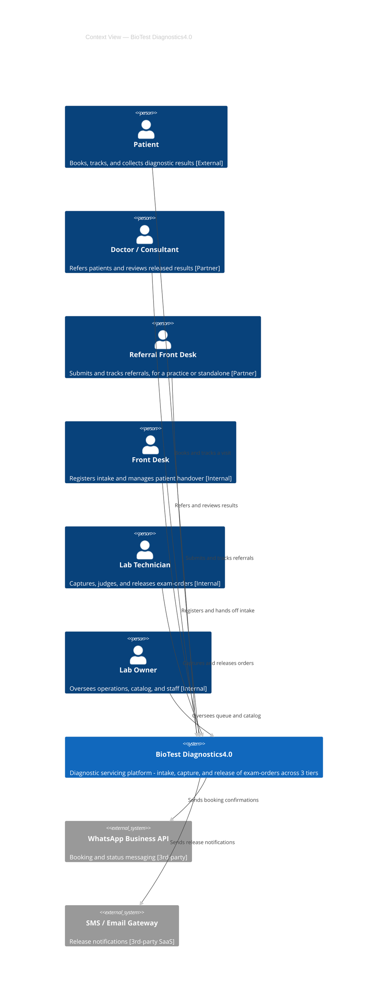

# BioTest Diagnostics4.0 — Context View (C4 L1)

> Notation: C4 Level 1 (System Context) | Renderer: Mermaid | Source: `business-requirements-specification.md`, `feature-backlog.md`

**Legend:**

| Arrow label | Protocol | Mode | Notes |
|---|---|---|---|
| Books and tracks a visit | HTTPS/REST | sync | Phone/email OTP or magic-link auth |
| Refers and reviews results | HTTPS/REST | sync | Single clinic-user role |
| Submits and tracks referrals | HTTPS/REST | sync | Standalone or practice-linked account |
| Registers and hands off intake | HTTPS/REST | sync | Internal staff auth |
| Captures and releases orders | HTTPS/REST | sync | Internal staff auth |
| Oversees queue and catalog | HTTPS/REST | sync | Internal staff auth, admin scope |
| Sends booking confirmations | WhatsApp Business API / HTTPS | async | Fire-and-forget, best-effort |
| Sends release notifications | HTTPS/REST (SMS/SMTP) | async | Fire-and-forget, best-effort |

**Notation:** Person = human actor. System (bold border) = BioTest, the system-in-scope. System_Ext (grey) = external 3rd-party system. Solid arrows = relationship, direction = initiator → recipient.

**Readability self-check:** PASS on density, arrow labels, split threshold, legend requirement. **FLAGGED:** Rule 6 (renderer selection) recommends PlantUML over Mermaid above 6 nodes for better auto-layout — this diagram has 9. Kept as Mermaid per explicit confirmation; revisit if the diagram becomes hard to read as rendered.
