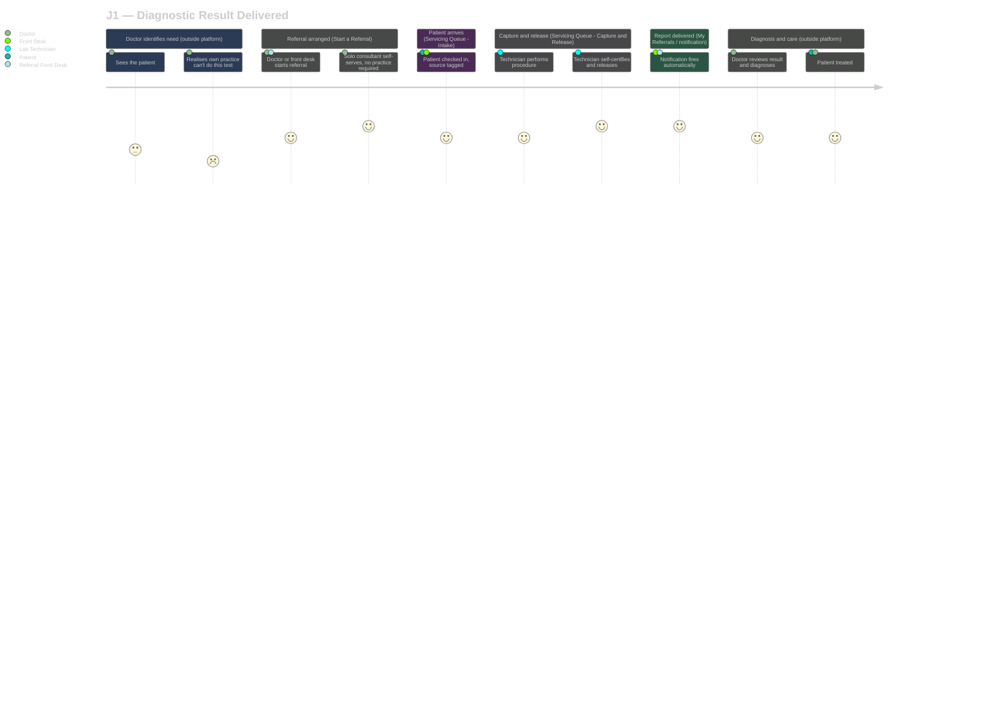
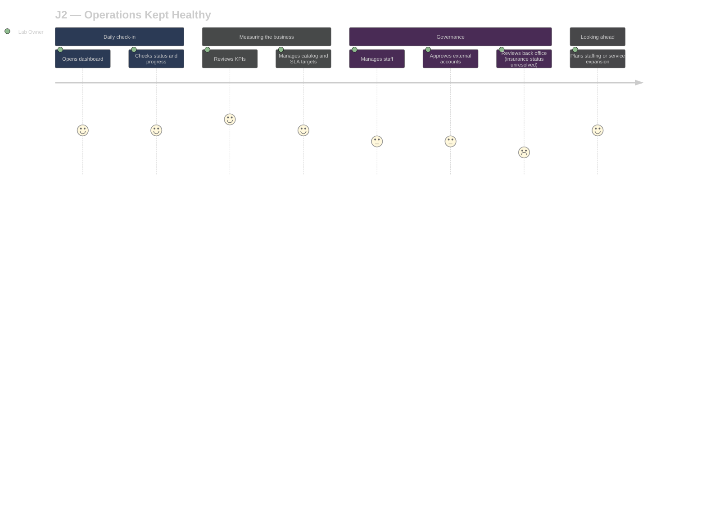

# BioTest Diagnostics4.0 — User Journeys

> Document type: User Journeys (goal-level, including stages outside the platform). Score = **persona emotional affect** (1–5), not UI smoothness — a journey can score low even with a flawless build if the persona is anxious or waiting. See `system-flows-journeys-playbook.md`.
>
> Source: `business-requirements-specification.md` §4.2 (User Segments), §5 (Shell Prototype Specification), §7.3 (Feature Backlog). No standalone System Flows document exists yet — flows are referenced by feature-backlog ID (`F-S0x-xx`) rather than a flow document; flagged as `[!]` open scope, not a gap in these journeys.

## Index

| Journey | Real-world goal | Primary actors |
|---|---|---|
| [J1 — Diagnostic Result Delivered](#j1) | A patient's diagnostic need becomes an acted-on diagnosis | Doctor/Consultant, Referral Front Desk, Patient, Front Desk (BioTest), Lab Technician |
| [J2 — Operations Kept Healthy](#j2) | BioTest's own business stays on top of throughput, quality, and growth | Lab Owner |

---

## J1 — Diagnostic Result Delivered {#j1}

[Back to index](#index)

Merges what were five separate single-actor views (Doctor, Referral Front Desk, Patient, Front Desk, Lab Technician) into one handoff chain, per the playbook's multi-actor merge rule — this is the same underlying goal seen from five sides, not five different goals.

**Underlying flows referenced:** `F-S01-11` (Start a Referral), `F-S02-08` (My Referrals), `F-S01-07` (Book a Visit), `F-S02-01` (Servicing Queue — Intake), `F-S02-02` (Servicing Queue — Capture & Release). `[!]` No formal System Flows document exists yet to give these task-level click sequences their own IDs — deferred until a prototype exists to trace against.

### Stage table

| Actor | What they do | Think / feel | Pain points | Opportunities | Touchpoints |
|---|---|---|---|---|---|
| Doctor/Consultant | Sees the patient, identifies a need their own practice can't fulfil | "I need this data to know what I'm treating." | No visibility into BioTest's real turnaround until now | SLA shown up front at referral time, not discovered after the fact | *Outside platform* — own practice |
| Doctor/Consultant or Referral Front Desk | Arranges the test — self, if solo, or via front desk | "Is this going to be one more system I have to log into for nothing?" | Historically no self-service option existed for a standalone referrer | `Start a Referral` accepts a solo consultant with no linked practice | (Start a Referral — RFP Marketplace) |
| Patient | Arrives — walk-in, self-booked, or referred | "How long is this actually going to take?" | No visibility into wait time historically | SLA shown at intake regardless of channel | (Servicing Queue — Intake) *and, for self-booked patients,* (Book a Visit) |
| Front Desk (BioTest) | Registers the order, tags its source, hands off to department | "Just get them checked in correctly the first time." | Manual, channel-specific intake habits pre-platform | One registration flow regardless of source | (Servicing Queue — Intake) |
| Lab Technician | Performs the procedure, judges accuracy, releases in one action | "I know if this capture is good — I shouldn't need someone else to tell me." | Previously modeled (incorrectly, corrected this session) as needing a second reviewer | Self-certified release — no second sign-off, no wait state | (Servicing Queue — Capture & Release) |
| Front Desk / Referral Front Desk | Report reaches the right place | "Did it actually get to them?" | No delivery confirmation in a purely manual world | Notification fires automatically on release | (Servicing Queue — Intake) *or* (My Referrals) |
| Doctor/Consultant | Reviews the result, forms the diagnosis | "Now the real work starts." | — | — | *Outside platform* — own practice, via (My Referrals) delivery only |
| Patient | Returns to their doctor, gets treated | "I just want to know what's wrong." | Historically disconnected from the referral loop entirely | Same-day turnaround reduces the anxious-wait stage | *Outside platform* — doctor's practice |

### Journey diagram

**Score guide:** 5 = delightful/reassuring, 3 = neutral, 1 = anxious/painful. Note the two lowest scores are both *outside the platform* (Doctor realizing they can't fulfil the need in-house) — the platform itself cannot fix that stage, only shorten what follows it.

---

## J2 — Operations Kept Healthy {#j2}

[Back to index](#index)

**Underlying flows referenced:** `F-S02-03` (Queue Oversight), `F-S03-01` (Operations Dashboard), `F-S02-04` (Staff & Roles), `F-S02-05` (Back Office), `F-S01-02` (Configure Catalog).

### Stage table

| Actor | What they do | Think / feel | Pain points | Opportunities | Touchpoints |
|---|---|---|---|---|---|
| Lab Owner | Opens the dashboard | "What actually happened today?" | Previously no aggregate view existed at all | Home lands on a real snapshot, not a blank slate | (Home) |
| Lab Owner | Checks status and progress | "Is anything stuck?" | No way to spot a stalled order without walking the floor | Queue-level oversight without gating any individual order | (Queue Oversight) |
| Lab Owner | Reviews KPIs | "Are we actually hitting same-day?" | The SLA claim was previously just a marketing line, unverified | Turnaround becomes a measured number, not an assumption | (Operations Dashboard) |
| Lab Owner | Manages the catalog | "Is this priced and timed right?" | SLA targets were guesses | Catalog Performance data informs real target-setting (AI-07, post-launch) | (Configure Catalog) |
| Lab Owner | Manages staff and approves external accounts | "Who's actually using this?" | No account governance existed pre-platform | Approval sits with the owner, not silently automatic | (Staff & Roles), (External Account Approval) |
| Lab Owner | Reviews back office | "Are we collecting what we're owed?" | Insurance/NHIF-SHA panel status still unconfirmed — `[!]` BRS §8 open question | — | (Back Office) |
| Lab Owner | Plans ahead | "Should we add a service, hire, or expand?" | Previously decisions were gut-feel, no throughput data to check them against | Data-informed expansion planning, including the deferred multi-site `site_id` insurance (BRS §6) | (Home) → (Operations Dashboard) |

### Journey diagram

**Score guide:** same 5–1 scale as J1, scored on Lab Owner's affect, not build quality. The back-office dip (2) is directly attributable to BRS §8's still-deferred insurance/NHIF-SHA question — this is a real, traceable low point, not a scoring artifact.

---

## Coverage sweep

Cross-checked against `feature-backlog.md`'s 6 named segments (BRS §4.2): Patient, Doctor/Consultant, Referral Front Desk, Front Desk, Lab Technician — all covered in J1. Lab Owner — covered in J2. No segment has zero journey coverage. `[!]` No System Flows document exists to cross-reference task-level click sequences — noted as an open item, not fabricated.
